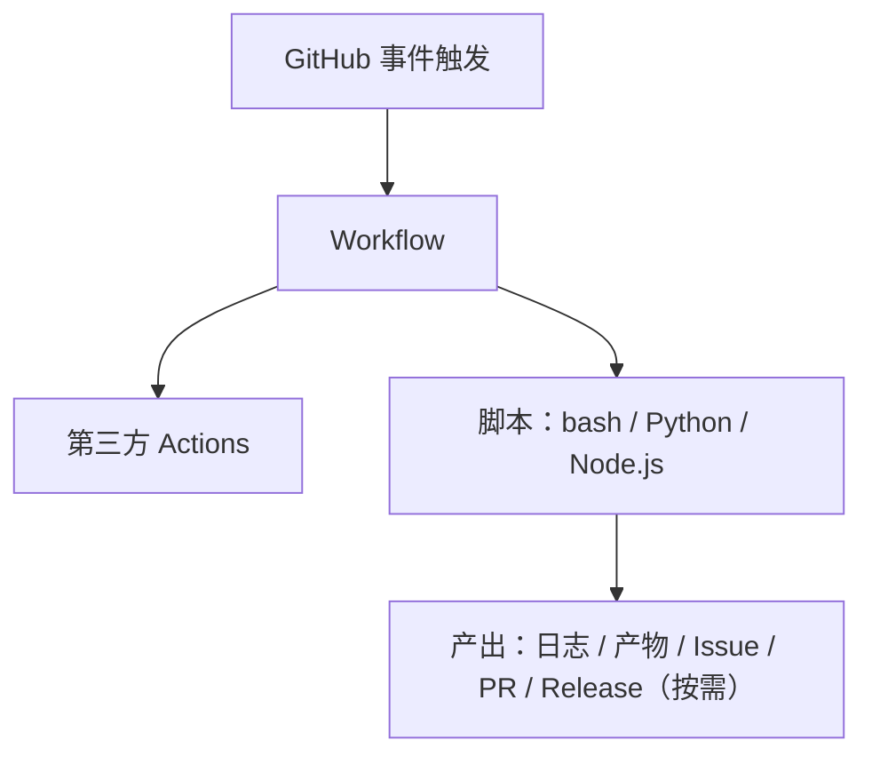
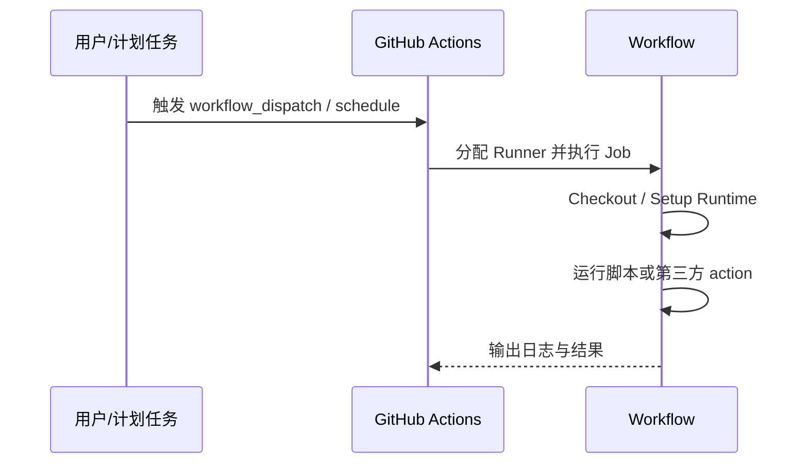

# 架构设计

## 总体架构

## 技术栈
- **自动化:** GitHub Actions（YAML）
- **脚本:** bash / Python / Node.js

## 核心流程

## 重大架构决策
完整的ADR存储在各变更的how.md中，本章节提供索引。

| adr_id | title | date | status | affected_modules | details |
|--------|-------|------|--------|------------------|---------|
| ADR-001 | 以“workflow 模板 + scripts 示例”作为仓库核心 | 2026-01-21 | ✅已采纳 | workflows, scripts, docs | [链接](../history/2026-01/202601210110_actions_repo_bootstrap/how.md#adr-001) |
